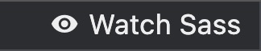

# Препроцесори

Крім вільного володіння базовими технологіями (HTML, CSS і JavaScript), розробник повинен вміти використовувати безліч допоміжних інструментів. Один з таких інструментів - це CSS-препроцесор - надбудова, що розширює CSS-синтаксис, полегшує написання, підтримку і рефакторинг коду. Препроцесори дозволяють використовувати конструкції, які прискорюють і спрощують написання коду.

<figure><figcaption></figcaption></figure>

Найпопулярніші препроцесори - це SASS, LESS і Stylus. Всі вони схожі і вирішують одне завдання, тому достатньо вибрати і використовувати один. Найпопулярніший препроцесор - SASS і його синтаксис SCSS.

✅ Переваги:

* **Сумісність** - синтаксис препроцесора повністю сумісний з уже існуючими CSS-правилами. Готовий CSS-код можна вставити в SASS-файл, але не навпаки.
* **Багатий функціонал** - велика кількість допоміжних конструкцій для спрощення основних завдань під час написання CSS-коду.
* **Структура проекту** - препроцесор дозволяє писати стилі в окремих файлах, що підвищує якість структури проекту та пошук стилів окремих блоків.
* **Чистота коду** - оскільки стилі пишуться в окремих файлах і застосовуються допоміжні конструкції для повторного використання коду, він стає чистішим.

❌ Недоліки:

* **Синтаксис** - додаткові конструкції препроцесора - це новий синтаксис, який необхідно вивчити і звикнути використовувати.
* **Компіляція** - крок підготовки коду препроцесора для браузера, тобто перетворення всіх синтаксичних конструкцій у звичайний CSS.

## Синтаксис

Спочатку препроцесор `SASS` мав однойменний синтаксис - `SASS`. Для опису вкладеності він використовує відступи (пробіли або таби), замість фігурних дужок, що знижує читабельність і підвищує ймовірність зробити помилку. Файли з цим синтаксисом мають розширення `.sass`, наприклад `main.sass`.


```scss
/* ❌ Старий синтаксис SASS | main.sass */

.box
  width: 400px
  height: 400px
  background-color: teal

  &:hover
      background-color: orange
```


Сьогодні використовується синтаксис `SCSS` (Sassy CSS), який є розширенням оригінального CSS-синтаксису. Це означає, що будь-яке допустиме значення в CSS-стилях буде працювати і в SCSS. Файли з цим синтаксисом мають розширення `.scss`, наприклад `main.scss`.


```scss
/* ✅ Новий синтаксис SCSS | main.scss */
.box {
  width: 400px;
  height: 400px;
  background-color: teal;

  &:hover {
    background-color: orange;
  }
}
```


## Компіляція

<figure><figcaption></figcaption></figure>

Браузер не розуміє синтаксису спеціальних конструкцій SASS, тому код препроцесора необхідно перетворити (скомпілювати) в CSS. Способів компіляції досить багато: різні консольні утиліти, збирачі і плагіни редактора.

Процес розробки зводиться до таких кроків.



#### Налаштування інструменту для компіляції

Налаштовуємо інструмент для компіляції SASS-коду.



#### Написання коду

Пишемо код у файлах з розширенням `.scss`.



#### Автоматична компіляція

SASS автоматично компілюється в CSS і створюється CSS-файл.



#### Підключення скомпільованого CSS

Підключаємо скомпільований CSS-файл в `index.html`.



### Налаштовуємо VSCode для роботи з препроцесором



#### Встановлення розширення

У редакторі VSCode додаємо розширення [Live Sass Compiler](https://marketplace.visualstudio.com/items?itemName=glenn2223.live-sass), для компіляції SASS.



#### Структура проєкту

В нашому проекті створюємо папку `.vscode`.



#### Файл налаштувань

В папці `.vscode` створюємо файл `settings.json`.



#### Додавання налаштувань

У файл `settings.json` додаємо наступні налаштування:




```json
{
  "liveSassCompile.settings.formats": [
    {
      "format": "expanded",
      "extensionName": ".css",
      "savePath": "/css"
    },
    {
      "format": "compressed",
      "extensionName": ".min.css",
      "savePath": "/css"
    }
  ],
  "liveSassCompile.settings.excludeList": [
    "/**/node_modules/**",
    "/.vscode/**"
  ],
  "liveSassCompile.settings.generateMap": true,
  "liveSassCompile.settings.autoprefix": ["> 1%", "last 2 versions"],
}
```


Під час роботи над файлами `*.scss` на панелі Status bar внизу вікна VSCode зʼявиться кнопка `Watch Sass`, якою запускається режим компіляції.

<figure><figcaption></figcaption></figure>

## Додаткові матеріали

* [Документація SASS](https://sass-lang.com/documentation)

