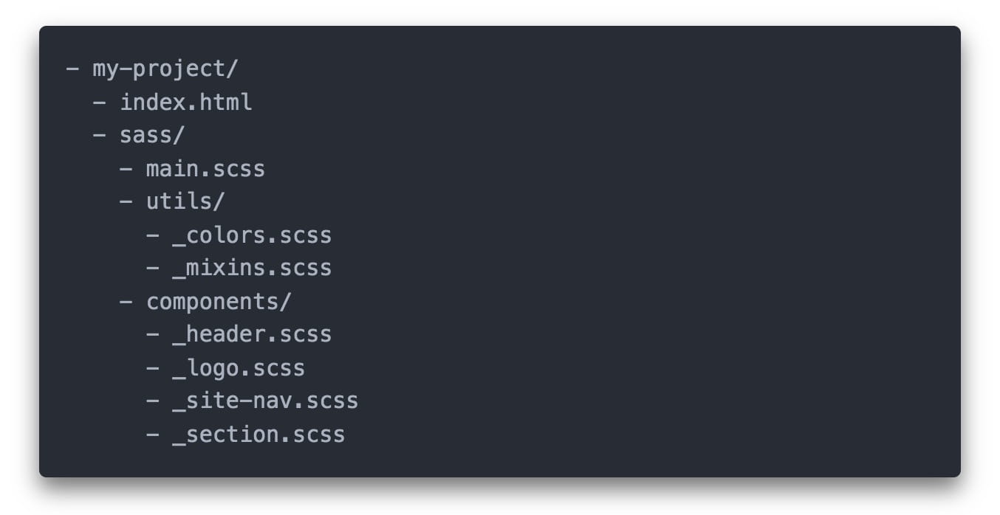

# Директива @use

Писати увесь код в одному великому файлі незручно. Тому препроцесор SASS дозволяє зберігати стилі в окремих файлах і збирати їх як мозаїку. Такий модульний підхід до написання коду спрощує рефакторинг і підтримку кодової бази.

Завдяки вбудованій директиві `@use` у SASS, абсолютно безпечно (і насправді рекомендується) використовувати стільки файлів, скільки необхідно в розробці. Всі вони потім будуть зібрані в одну таблицю стилів і так потраплять на продакшен.

Крім того, ми не можемо не наголосити на потребі в папках, навіть на невеликих проектах. Вдома ви не кладете кожен аркуш паперу в один і той самий ящик. Ви використовуєте папки: одну для дому, іншу для банку, третю для рахунків, і таке інше. З цієї ж причини варто розділяти кодову базу на папки, щоб пізніше було легко знайти потрібний код.

За замовчуванням SASS-компілятор створює CSS-файл для кожного Sass-файлу, який зустріне в проекті. Для того щоб після компіляції отримати всього один файл стилів, використовують фрагменти (partials) — звичайні Sass-файли, ім'я яких починається з нижнього підкреслення, наприклад `_logo.scss`. Нижнє підкреслення говорить компілятору про те, що це фрагмент і він не повинен компілюватися в окремий CSS-файл, а буде використаний в іншому Sass-файлі.

<figure><figcaption></figcaption></figure>

На ілюстрації зображена базова структура Sass-файлів в проекті. В папці `sass` є один головний файл `main.scss`, для якого після компіляції буде створений файл `main.css`, який ми підключаємо в `index.html`. В папках `utils` і `components` лежать фрагменти, які будуть частиною `main.scss`.

## Робота з паршалами

Для того, щоб підключити фрагмент (модуль) рекомендується використовувати директиву `@use`. Директива `@use` завантажує змінні, міксини та функції з інших таблиць стилів Sass і поєднує разом CSS із кількох таблиць стилів. Таблиці стилів, які завантажує `@use` називаються «модулями».

Для того, щоб підключити модуль достатньо використати директиву `@use` із параметром `<url>`, який завантажує модуль за заданим URL. Будь-які стилі, завантажені таким чином, будуть включені рівно один раз у скомпільований CSS-файл, незалежно від того, скільки разів ці стилі були підключені в проекті.

```scss
/* SCSS | main.scss */
@use 'utils/colors';
@use 'utils/mixins';
@use 'components/header';
@use 'components/logo';
@use 'components/site-nav';
@use 'components/section';
```

Коли компілятор зустрічає директиву `@use`, він підставляє код імпортованого файлу на місце імпорту. Після компіляції виходить один CSS-файл, скомпільований з декількох фрагментів.

## Імена в імпорті

Зверніть увагу на те, що ми використовуємо `@use 'components/logo'` у файлі `main.scss`. Під час імпорту фрагмента не потрібно вказувати розширення `.scss` і нижнє підкреслення, SASS-компілятор здогадається сам і знайде цей файл. Головне — задати правильний відносний шлях.

## Різновиди імпортів з директивою `@use`

Вище ми розглянули простий імпорт модуля, проте потужність директиви `@use` полягає у тому, що ми можемо отримати більше контролю над модулем за рахунок використання простору імен `<namespace>`. Отримати доступ до змінних, функцій і міксинів з іншого модуля можна написавши `<namespace>.<variable>`, `<namespace>.<function>()` або `@include <namespace>.<mixin>()`. За замовчуванням простір імен модуля є лише останнім компонентом його URL-адреси без розширення файлу.

```scss
/* utils/_variables.scss */
$smallRadius: 6px; // оголошуємо змінні
$largeRadius: 12px;
```

```scss
/* utils/_mixins.scss */

@mixin button() {
  font-size: 14px;
  background-color: teal;
}
```

```scss
/* style.scss */
@use "utils/variables";
@use "utils/mixins";

.button {
  @include mixins.button();

  padding: 10px + variables.$smallRadius;
  border-radius: variables.$smallRadius;
}
```

В цьому прикладі після імпорту модулів у нас в коді стають доступними два namespace: `variables` та `mixins`. Для доступу до змінної **$smallRadius** використовується назва модуля `variables`, прописана в кінці шляху директиви `@use`, та через крапку вказується ім'я самої змінної.

Проте іноді модулі мають досить довгі назви і звертатись кожного разу за такою назвою буде не дуже зручно. Тому для таких випадків передбачено можливість перейменування модуля під час імпорту. Для цього використовується ключове слово `as`, після якого можна вказати нову назву модуля.

```scss
/* utils/_variables.scss */

$smallRadius: 6px;
$largeRadius: 12px;
```

```scss
/* style.scss */
@use "utils/variables" as v;

.button {
  padding: 10px + v.$smallRadius; // тепер можемо використати v замість variables
  border-radius: v.$smallRadius; // тепер можемо використати v замість variables
}
```

Ще один із варіантів імпорту модулів надає нам можливість імпортувати модуль без визначення простору імен, вказавши після ключового слова `as` символ зірочки `*`

```scss
/* utils/_variables.scss */

$smallRadius: 6px;
$largeRadius: 12px;
```

```scss
/* style.scss */
@use "utils/variables" as *;

.button {
  padding: 10px + $smallRadius; // тепер можемо звертатись до змінної за її іменем
  border-radius: $smallRadius; // тепер можемо звертатись до змінної за її іменем
}
```


Такий підхід трохи суперечить принципу модульності і може призводити до небажаних результатів після компіляції коду, таких як конфлікт імен при використанні змінних, міксинів чи функцій. Тому варто віддати перевагу першим двом підходам.


## Управління доступом до сутностей в середині модуля

Sass-модулі мають вбудований механізм доступу до змінних, функцій і міксинів між модулями. Для цього перед назвою сутності на початку слід використати знак `-` або `_`. Це зробить сутність приватною (прихованою), її використання за межами поточного модуля не можливе і призведе до помилки. Це необхідно для ізоляції сутності в середині модуля, щоб інші розробники не могли вплинути на значення цієї сутності зовні.

```scss
/* utils/_variables.scss */

$primaryColor1: orangered;
$-primaryColor2: darkcyan;
```

```scss
/* style.scss */
@use "utils/variables" as v;

.button {
  color: v.$primaryColor1; // значення змінної буде підставлено у властивість
  background-color: v.$primaryColor2; // отримаємо помилку компіляції, оскільки змінна приватна
  background-color: v.$-primaryColor2; // отримаємо помилку компіляції, навіть якщо вкажемо -
}
```

## Сумісність із CSS-файлами

Файли стилів, написані із застосуванням синтаксису препроцесору Sass і розширенням `*.scss`, підтримують стилі звичайних CSS-файлів, тому маючи CSS-файл ми також можемо імпортувати його до модуля.

```css
/* reset.css */
button {
  font-family: inherit;
  color: currentColor;
  cursor: pointer;
}
```

```scss
/* style.scss */
@use "utils/variables";
@use "utils/mixins";
@use "utils/reset.css";

.button {
  @include mixins.button();

  padding: 10px + variables.$smallRadius;
  border-radius: variables.$smallRadius;
}
```
